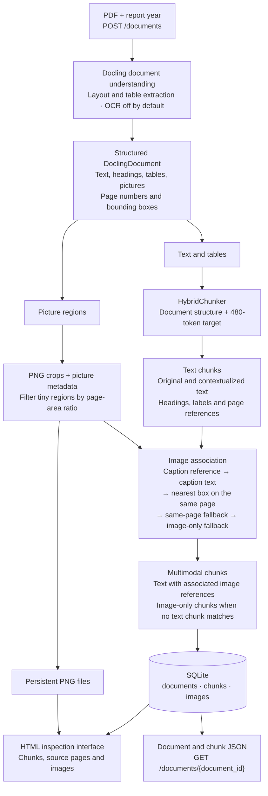

# Multimodal Document Ingestion

A multimodal document ingestion pipeline for annual-report PDFs.

The system extracts and preserves **text, tables, images, document structure, and source-page references**, chunks the extracted content, associates images with their corresponding chunks, and stores the results in SQLite.

The project currently focuses on **ingestion and inspection**. Embeddings, vector search, retrieval, and answer generation are outside the current scope.

## Pipeline



The two branches show how text and pictures are processed before association.
Chunks without matching pictures remain text-only. SQLite stores document and
chunk data plus image metadata and file paths; PNG bytes live separately on disk.
During API ingestion, the uploaded PDF and intermediate extraction/chunk files
are temporary and are removed after the request.

The pipeline preserves document structure and provenance so the resulting chunks can later be used as input to a multimodal retrieval system.

## Tech Stack

| Component   | Technology                               |
| ----------- | ---------------------------------------- |
| Runtime     | Python 3.12                              |
| API         | FastAPI + Uvicorn                        |
| PDF parsing | Docling                                  |
| PDF backend | PDFium (`pypdfium2`)                     |
| Chunking    | Docling `HybridChunker`                  |
| Tokenizer   | `sentence-transformers/all-MiniLM-L6-v2` |
| Persistence | SQLite + SQLAlchemy                      |
| Testing     | pytest + HTTPX                           |
| Linting     | Ruff                                     |
| Packaging   | Docker + Docker Compose                  |
| CI          | GitHub Actions                           |

## Quick Start

### 1. Start the application

Install Docker Desktop or Docker Engine with the Compose plugin.

From the repository root:

```bash
docker compose up --build -d --wait
```

The first build downloads the Python dependencies. Docling models are downloaded during the first ingestion request and cached for later use.

The application runs on CPU.

For Docker Desktop, **4 CPUs and 8 GB of memory** is a reasonable starting allocation.

### 2. Upload a PDF

Open:

```text
http://127.0.0.1:8000/docs
```

Then:

1. Expand `POST /documents`
2. Click **Try it out**
3. Select a PDF
4. Enter the report year
5. Click **Execute**

The response contains:

* `document_id`
* `filename`
* `year`
* `total_pages`
* `chunk_count`
* `debug_url`

Open the returned `debug_url` to inspect the extracted document.

Alternatively:

```bash
curl --fail-with-body \
  -F 'file=@data/raw/report_2022.pdf' \
  -F 'year=2022' \
  http://127.0.0.1:8000/documents
```

## Inspection Interface

The debug page provides a human-readable view of the ingestion result.

For each chunk it displays:

* original text
* headings
* Docling labels
* source-page range
* associated images

Images are served through:

```text
/debug/images/{image_id}
```

A machine-readable representation of a document is available at:

```text
/documents/{document_id}
```

This makes it possible to compare the final stored representation directly against the source PDF.

## Extraction and Chunking

PDFs are parsed using **Docling**, preserving document structure and provenance.

The extracted document is then processed using Docling's `HybridChunker`.

Chunking uses:

```text
sentence-transformers/all-MiniLM-L6-v2
```

with a target size of **480 tokens**.

The target is not a strict maximum because structural boundaries are prioritized when creating chunks.

Each chunk preserves:

* original text
* contextualized text
* headings
* document labels
* source page numbers
* Docling metadata

The contextualized representation is stored so it can later be used for embedding and retrieval experiments.

### Image association

Picture regions detected by Docling are exported as PNG files.

Images are associated with chunks using their document provenance and page information. Image metadata including page number, bounding box, and optional caption is persisted alongside the corresponding chunk.

## Persistence

Metadata is stored in SQLite using three related tables:

```text
documents (1) ── (many) chunks (1) ── (many) images
```

### Documents

Stores information such as:

* filename
* report year
* total pages
* source hash

### Chunks

Stores:

* chunk index
* original text
* contextualized text
* page range
* headings
* labels

### Images

Stores:

* associated chunk
* page number
* image path
* caption
* bounding box

Document, chunk, and image records are committed transactionally.

The actual image files are stored separately on disk.

## Persistent Docker Storage

Docker Compose creates persistent volumes for:

```text
database    SQLite database
images      Extracted PNG images
models      Docling / Hugging Face model cache
```

The database and extracted images survive container recreation and rebuilds.

To stop and restart the application:

```bash
docker compose stop
docker compose start
```

To remove containers while keeping the stored data:

```bash
docker compose down
```

> `docker compose down --volumes` deletes the database, extracted images, and model cache.

## Tests

Run the test suite inside Docker:

```bash
docker compose --profile test run --build --rm tests
```

Run lint and formatting checks:

```bash
docker compose --profile test run --rm tests python -m ruff check --no-cache app tests

docker compose --profile test run --rm tests python -m ruff format --check --no-cache app tests
```

Tests cover:

* API validation
* ingestion orchestration
* page-range handling
* chunk/image association
* database persistence and rollback
* debug routes
* HTML escaping
* missing resources

Tests use small generated fixtures and therefore do not require the source annual-report PDFs or downloaded Docling models.

GitHub Actions runs the automated tests, lint checks, container build, startup checks, and storage permission checks.

## Local Development

Docker is the recommended way to run the project.

For local development, use Python 3.12:

```bash
python3.12 -m venv .venv
source .venv/bin/activate

python -m pip install -r requirements-dev.txt

python -m app.main
```

Run the local checks with:

```bash
.venv/bin/python -m pytest
.venv/bin/python -m ruff check app tests
.venv/bin/python -m ruff format --check app tests
```

## Repository Structure

```text
app/                    API, extraction, chunking, images, database, debug view
tests/                  Automated tests
Dockerfile              Runtime and test image stages
compose.yaml            Application, tests, and persistent volumes
.github/workflows/      CI configuration
.env.example            Optional local configuration
requirements*.txt       Python dependencies
pyproject.toml          pytest and Ruff configuration
data/raw/               User-supplied PDFs (ignored)
local/                  Local outputs and model caches (ignored)
```

Source PDFs, databases, model caches, virtual environments, `.env` files, and local experiments are excluded from Git.

## Manual validation

The complete ingestion pipeline was manually exercised with a **four-page
excerpt (physical pages 8–11) of the supplied 2022 report**, rather than the
full 674-page PDF. The local run extracted it with Docling, generated 23
HybridChunker chunks, associated and persisted 19 images, and rendered the
saved chunks and images in the HTML inspection view. The same PDF was ingested
in Docker, where 25 chunks were persisted. Comparing the extraction JSONs
showed that the difference originated in Docling's layout extraction across
macOS ARM and Linux, rather than in HybridChunker.

Automated tests use small generated fixtures and mock the expensive Docling
request path. They verify orchestration and persistence without large PDFs or
model downloads in CI; the real-PDF run above checks the complete pipeline.

## Known Limitations

### Environment-dependent layout extraction

Docling layout predictions can vary slightly between execution environments.

During validation, a small difference was observed between **macOS ARM** and the **Linux Docker environment**, including one very short chunk around a table unit.

Cross-testing the extraction and chunking outputs showed that the difference originated during **Docling layout extraction rather than the chunking stage**.

Short chunks are not automatically merged because doing so around tables could incorrectly associate values, labels, or units. A production implementation could address these cases with layout-aware or table-aware normalization.

### Other limitations

* OCR is disabled for the default selectable-text PDF workflow.
* Table extraction can occasionally misidentify headers or boundaries.
* Uploads are processed synchronously.
* Large full-report runtime and memory usage have not been benchmarked.
* The API is intended for local evaluation and does not currently include authentication.
* Embeddings, vector search, retrieval, and answer generation are not yet implemented.
